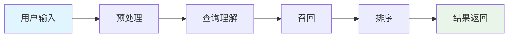
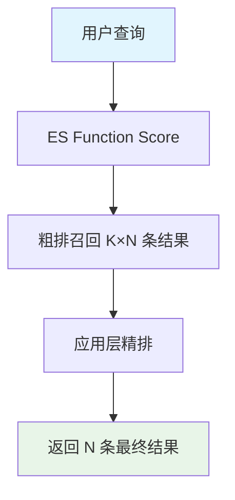

---
# try also 'default' to start simple
theme: seriph
# random image from a curated Unsplash collection by Anthony
# like them? see https://unsplash.com/collections/94734566/slidev
background: https://cover.sli.dev
# some information about your slides (markdown enabled)
title: 搜索技术培训
info: |
  ## 搜索技术培训材料
  深入了解搜索系统的架构、评分体系、召回排序和参数调优

  盒子科技 · 技术培训
# apply UnoCSS classes to the current slide
class: text-center
# https://sli.dev/features/drawing
drawings:
  persist: false
# slide transition: https://sli.dev/guide/animations.html#slide-transitions
transition: slide-left
# enable MDC Syntax: https://sli.dev/features/mdc
mdc: true
---

# 搜索技术培训

深入理解搜索系统的技术架构与优化策略

<div class="pt-12">
  <span @click="$slidev.nav.next" class="px-2 py-1 rounded cursor-pointer" hover:bg="white op-10">
    开始学习 <carbon:arrow-right class="inline"/>
  </span>
</div>

<div class="abs-br m-6 flex gap-2">
  <button @click="$slidev.nav.openInEditor()" title="Open in Editor" class="slidev-icon-btn opacity-50 !border-none !hover:text-white">
    <carbon:edit />
  </button>
  <a href="https://github.com/kawowl" target="_blank" alt="GitHub" title="Open in GitHub" class="slidev-icon-btn opacity-50 !border-none !hover:text-white">
    <carbon:logo-github />
  </a>
</div>

<!--
搜索技术培训材料 - 涵盖搜索系统的完整技术栈
-->

---
transition: fade-out
layout: default
---

# 课程目录

<Toc columns="1" maxDepth="1"></Toc>

<style>
h1 {
  background-color: #2B90B6;
  background-image: linear-gradient(45deg, #4EC5D4 10%, #146b8c 20%);
  background-size: 100%;
  -webkit-background-clip: text;
  -moz-background-clip: text;
  -webkit-text-fill-color: transparent;
  -moz-text-fill-color: transparent;
}
</style>

---
transition: slide-up
level: 1
---

# 第一章：搜索过程概览

## 🔍 搜索系统整体架构

<div v-click class="text-center my-8">



</div>

<div v-click class="grid grid-cols-2 gap-4 mt-4">

**核心流程**
- 预处理：输入过滤、分词、规范化
- 查询理解：实体识别、同义词扩展
- 召回：多策略召回、粗排
- 排序：精排、个性化
- 返回：分页、结果优化

**关键组件**
- Elasticsearch：核心搜索引擎
- Prisma ORM：数据库操作
- 缓存系统：多层缓存优化
- 日志系统：性能监控

</div>

<!--
搜索系统整体架构图，展示从用户输入到结果返回的完整流程
-->

---
transition: slide-up
level: 2
---

# 1.1 预处理阶段

<div class="grid grid-cols-2 gap-8">

<div>

## 📝 主要功能

<v-clicks>

- **输入过滤**: 去除禁用词、特殊字符、拼音识别
- **分词处理**: 使用动态词典进行分词，支持新词自动识别  
- **查询规范化**: 去除括号内容、标准化输入格式

</v-clicks>

</div>

<div>

## 💡 处理示例

<v-click>

**输入过滤**
```
"apple苹果手机！！！" 
→ "apple苹果手机"
```

</v-click>

<v-click>

**分词处理**
```
"苹果手机" 
→ ["苹果", "手机"]
```

</v-click>

<v-click>

**查询规范化**
```
"iPhone 15（Pro Max版本）" 
→ "iPhone 15"
```

</v-click>

</div>

</div>

<!--
预处理阶段是搜索的第一步，负责清理和标准化用户输入
-->

---
level: 2
---

# 1.2 查询理解阶段

<div class="space-y-6">

<div v-click>

## 🧠 命名实体识别
识别品牌、类目、属性、标签等实体

```typescript
input: "苹果手机"
output: {
  brand: "苹果",
  category: "手机"
}
```

</div>

<div v-click>

## 🎯 精准匹配
直接匹配系统中已有的品牌和类目

```typescript
input: "华为"
output: { brandId: "huawei", confidence: 1.0 }
```

</div>

<div v-click>

## 📚 同义词扩展
使用同义词库扩展未直接匹配的类目

```typescript
input: "笔记本"
expanded: ["笔记本电脑", "便携式电脑", "laptop"]
```

</div>

<div v-click>

## 🔍 向量搜索扩展
基于语义向量进行品牌和类目扩展

```typescript
input: "游戏本"
semantic_similar: ["电竞笔记本", "高性能笔记本"]
similarity_score: 0.85
```

</div>

</div>

<!--
查询理解阶段通过多种技术手段理解用户的真实意图
-->

---
level: 2
---

# 1.3 评分与召回阶段

<div class="grid grid-cols-2 gap-6">

<div>

## 📊 多因子联合评分

<v-clicks>

- **实体关系评分**: 品牌、类目匹配度
- **用户偏好评分**: 个人历史行为
- **平台热度评分**: 商品受欢迎程度

</v-clicks>

<v-click>

**计算示例**：
```typescript
"苹果手机" → 
品牌权重: 2.0 × 类目权重: 1.5 
= 联合评分: 3.5
```

</v-click>

</div>

<div>

## 🎯 ES粗排召回

<v-click>

**BM25算法** + **业务权重**
```typescript
final_score = BM25: 12.5 
            + 语义增强: 3.2 
            + 质量评分: 1.8 
            = 总分: 17.5
```

</v-click>

<v-click>

**得分归一化**
```typescript
销量: 10000件 
→ 归一化: 0.85分 (0-1区间)
Math.log1p(score/k) / Math.log1p(xmax/k)
```

</v-click>

</div>

</div>

<!--
召回阶段通过多种评分策略筛选出最相关的商品候选集
-->

---
level: 2
---

# 1.4 精排阶段

## 🚀 业务模型精排

<div v-click class="my-6">

综合BM25、语义增强、商品质量等多维度评分

```typescript
最终评分 = ES评分 + 品牌加权 + 销量加权 + 质量评分
```

</div>

<div v-click>

### 排序示例对比

<div class="grid grid-cols-2 gap-4 mt-4">

**商品A**
```
ES评分: 17.5
品牌加权: +2.0  
销量加权: +1.2
━━━━━━━━━━━━
总分: 20.7 ⭐
```

**商品B**  
```
ES评分: 15.8
品牌加权: +1.5
销量加权: +2.8  
━━━━━━━━━━━━
总分: 20.1
```

</div>

**最终排序**: 商品A > 商品B

</div>

<div v-click class="mt-6">

### 分页返回
根据用户需求返回相应页码的结果
- 用户请求第2页，每页20条 → 返回第21-40条结果

</div>

<!--
精排阶段对召回结果进行精细化排序，确保最相关的商品排在前面
-->

---
level: 2
layout: center
---

# 💡 完整搜索示例流程

<div class="text-left">

<div v-click>

**用户输入**: `"华为笔记本电脑"`

</div>

<div v-click class="ml-4 space-y-2">

1. **预处理**: `"华为笔记本电脑"` → `["华为", "笔记本电脑"]`
2. **实体识别**: 品牌=`"华为"`, 类目=`"笔记本电脑"`  
3. **评分计算**: 品牌匹配度`2.0` + 类目匹配度`1.5` + BM25评分`8.3`
4. **召回结果**: 300件相关商品（K倍窗口扩展）
5. **精排输出**: 按综合评分排序，返回前20件商品
6. **响应时间**: 总耗时`120ms`（ES查询`80ms` + 业务逻辑`40ms`）

</div>

</div>

<!--
通过华为笔记本电脑的完整搜索示例，展示整个搜索流程的具体执行过程
-->

---
transition: slide-left
level: 1
---

# 第二章：搜索评分体系

## 🎯 评分体系架构

<div v-click class="my-8 p-4 bg-gray-100 rounded-lg">

```typescript
最终评分 = BM25评分 × 权重配置 + 语义增强评分 + 商品质量评分 + 品牌提升评分
```

</div>

<div class="grid grid-cols-2 gap-8 mt-8">

<div v-click>

### 🔍 核心算法
- **BM25基础评分**: TF-IDF改进版
- **语义增强评分**: 实体匹配加权
- **商品质量评分**: 销售数据评估
- **品牌提升评分**: 店铺信誉加权

</div>

<div v-click>

### ⚡ 性能优化
- **归一化处理**: 对数缩放避免长尾
- **权重配置**: 动态调整评分比例
- **缓存机制**: 减少重复计算
- **分层评分**: 粗排+精排结合

</div>

</div>

<!--
搜索评分体系是整个搜索算法的核心，决定了商品排序的质量
-->

---
level: 2
---

# 2.1 BM25基础评分

<div class="grid grid-cols-2 gap-8">

<div>

## 📐 算法原理

<v-click>

**BM25**: TF-IDF的改进版本，考虑词频饱和度

</v-click>

<v-click>

**归一化处理**: 使用对数缩放避免长尾效应

```typescript
// TitleBM25归一化脚本
double total = Math.log1p(_score/k) 
               / Math.log1p(xmax/k);
return total * weight;
```

</v-click>

</div>

<div>

## 🎯 评分特点

<v-clicks>

- **词频饱和**: 避免单一词汇过度影响
- **文档长度归一化**: 公平对比不同长度文本
- **逆文档频率**: 稀有词汇获得更高权重
- **参数可调**: k1、b参数控制算法行为

</v-clicks>

<v-click>

```typescript
BM25(q,d) = Σ IDF(qi) × 
            f(qi,d) × (k1 + 1) /
            (f(qi,d) + k1 × (1-b + b×|d|/avgdl))
```

</v-click>

</div>

</div>

<!--
BM25是现代搜索引擎的标准评分算法，平衡了词频和文档长度的影响
-->

---
level: 2
---

# 2.2 语义增强评分 (SemanticEnhancement)

<div class="space-y-6">

<div v-click>

## ⚖️ 权重分布

```typescript
brand_weight: 2.0      // 品牌匹配权重 - 最高优先级
category_weight: 1.5   // 类目匹配权重 - 中等优先级  
spec_weight: 1.0       // 规格匹配权重 - 基础优先级
```

</div>

<div v-click>

## 🧮 计算公式

**计算公式**：
```javascript
total = brand_score * brand_weight + 
        catF_score * category_weight + 
        catR_score * category_weight
```

</div>

<div v-click>

## 💡 实际应用示例

<div class="grid grid-cols-3 gap-4">

**品牌匹配**
```
查询: "苹果手机"
品牌: "苹果" ✓
得分: 2.0 × 1.0 = 2.0
```

**类目匹配**  
```
查询: "苹果手机"
类目: "手机" ✓
得分: 1.5 × 1.0 = 1.5
```

**组合得分**
```
语义增强总分:
2.0 + 1.5 = 3.5
```

</div>

</div>

</div>

<!--
语义增强评分通过实体匹配提升搜索结果的相关性
-->

---
level: 2
---

# 2.3 商品质量评分 (ProductQuality)

<div class="grid grid-cols-2 gap-8">

<div>

## 📈 销售数据权重分布

<v-click>

```typescript
近30天销量:  60%权重  // 反映当前热度
近365天销量: 30%权重  // 反映稳定性  
历史总销量:  10%权重  // 反映经典程度
```

</v-click>

<v-click>

## 🧮 计算公式

```typescript
skuScore = (sku30 * 0.6) + 
           (sku365 * 0.3) + 
           (skuTotal * 0.1)
```

</v-click>

</div>

<div>

## 🎯 归一化处理

<v-click>

```typescript
normalizedScore = 
  Math.log1p(skuScore/k) / 
  Math.log1p(xmax/k)
```

**参数说明**:
- `k`: 缩放因子 (通常为100)
- `xmax`: 最大期望值 (通常为1000)

</v-click>

<v-click>

## 📊 实际示例

```
原始销量: 10000件
归一化后: 0.85分 (0-1区间)
```

</v-click>

</div>

</div>

<!--
商品质量评分基于销售数据，反映商品的市场表现和用户认可度
-->

---
level: 2
---

# 2.4 其他评分组件

<div class="grid grid-cols-2 gap-6">

<div>

## 🏪 品牌提升评分 (OriginalBrandBoost)

<v-click>

**店铺信誉评分**:
- 官方店铺: +0.5分
- 旗舰店铺: +0.2分  
- 品牌匹配: +1.0分

</v-click>

<v-click>

## ⭐ 供应商星级评分 (VenderStarLevel)

- 1-5星评级: 直接使用星级作为权重
- 优质标签: "premium"标签额外加权

</v-click>

</div>

<div>

## ⚖️ 业务权重评分 (BusinessWeight)

<v-click>

**测试模式权重**:
```typescript
testWeight.brand + 
testWeight.product + 
testWeight.shop +
testWeight.vender + 
testWeight.categoryFront + 
testWeight.categoryRaw
```

</v-click>

<v-click>

**正式模式权重**:
```typescript
formalWeight.brand + 
formalWeight.product + 
formalWeight.shop +
formalWeight.vender + 
formalWeight.categoryFront + 
formalWeight.categoryRaw
```

</v-click>

</div>

</div>

<!--
多种评分组件协同工作，为商品提供全方位的质量评估
-->

---
transition: slide-left
level: 1
---

# 第三章：搜索粗排和精排

## ⚡ 两阶段排序架构

<div class="grid grid-cols-2 gap-8 mt-8">

<div v-click>

### 🔍 粗排阶段 (Elasticsearch层面)
- **Function Score查询**: 多维度评分合并
- **召回窗口**: K倍扩展策略(默认K=30)
- **SPU/SKU处理**: 去重聚合与属性统计
- **性能优化**: 分页优化与过滤条件

</div>

<div v-click>

### 🎯 精排阶段 (应用层面)  
- **排序器架构**: 多级排序组合
- **排序顺序配置**: 可配置优先级
- **分组排序策略**: 货架式排列
- **业务逻辑**: 个性化与推荐

</div>

</div>

<div v-click class="mt-8 text-center">



</div>

<!--
粗排和精排的两阶段架构平衡了性能和准确性
-->

---
level: 2
---

# 3.1 粗排阶段 - Function Score查询

<div class="space-y-6">

<div v-click>

## 🔧 Function Score查询结构

````md magic-move {lines: true}
```typescript {*|3|5-11|12-13}
{
  function_score: {
    query: { /* BM25基础查询 */ },
    functions: [
      { script_score: { script: semanticEnhancementScript } },
      { script_score: { script: originalBrandBoostScript } },
      { script_score: { script: productQualityScoreScript } },
      { script_score: { script: titleBM25NormalizerScript } },
      { script_score: { script: businessWeightScript } }
    ],
    score_mode: "sum",     // 评分合并方式：相加
    boost_mode: "replace"  // 替换原始BM25评分
  }
}
```

```typescript {*|2-3|4-5}
// 粗排召回策略配置
{
  from: (page-1) * size * K,    // 召回窗口起始位置
  size: pageSize * K,           // 召回数量 = 页面大小 × K倍
  _source: false,               // 不返回完整文档内容
  track_total_hits: true        // 跟踪总命中数
}
```
````

</div>

<div v-click>

## 📊 召回窗口策略

- **K倍扩展窗口**: 默认K=30，确保精排有足够候选
- **分页优化**: 避免深度分页性能问题
- **过滤条件**: 品牌、类目、价格、库存等业务过滤

</div>

</div>

<!--
Function Score查询整合多个评分脚本，实现复合评分策略
-->

---
level: 2
---

# 3.2 SPU/SKU处理策略

<div class="grid grid-cols-2 gap-8">

<div>

## 📦 SPU模式

<v-click>

**去重聚合**: 使用`collapse`功能按`spuId`去重

```typescript
collapse: {
  field: "spuId",
  inner_hits: {
    name: "variants",
    size: 3
  }
}
```

</v-click>

<v-click>

**统计聚合**: 获取真实SPU数量

```typescript
aggs: {
  distinct_spu_count: {
    cardinality: { field: "spuId" }
  }
}
```

</v-click>

</div>

<div>

## 🏷️ SKU模式

<v-click>

**直接返回**: 返回所有SKU结果，不进行去重

</v-click>

<v-click>

**多SKU展示**: 支持同一SPU下多个SKU的展示

```typescript
// 同一商品的不同规格
{
  spuId: "iphone15",
  variants: [
    { skuId: "iphone15-128g-blue" },
    { skuId: "iphone15-256g-red" },
    { skuId: "iphone15-512g-black" }
  ]
}
```

</v-click>

<v-click>

**属性聚合**: 收集可筛选的商品属性

```typescript
aggs: {
  brands: { terms: { field: "brandName" } },
  categories: { terms: { field: "categoryName" } },
  priceRanges: { range: { field: "price" } }
}
```

</v-click>

</div>

</div>

<!--
SPU/SKU处理策略影响搜索结果的展示方式和用户体验
-->

---
level: 2
---

# 3.3 精排阶段 - 排序器架构

<div class="space-y-6">

<div v-click>

## 🎯 排序器映射表

```typescript
const sorterMap = {
  first: byScore(),              // ES评分排序 - 主评分
  OBB: byOriginalBrandBoost(),   // 品牌提升排序 - 店铺权重  
  SEM: bySemanticEnhancement(),  // 语义增强排序 - 实体匹配
  PQ: byProductQuality(),        // 商品质量排序 - 销售数据
  VSL: byVenderStarLevel(),      // 供应商星级 - 信誉评分
  PR: byPremium()               // 优质标签排序 - 高端商品
}
```

</div>

<div v-click>

## 📋 默认排序配置

```typescript
sorterOrder: "first,OBB,SEM,PQ,VSL,PR"
```

**优先级解释**:
1. **first**: ES综合评分（主排序依据）
2. **OBB**: 品牌店铺权重（提升官方店铺）
3. **SEM**: 语义匹配度（相关性优化）
4. **PQ**: 商品销售质量（市场表现）
5. **VSL**: 供应商信誉（服务质量）
6. **PR**: 优质商品标识（高端定位）

</div>

</div>

<!--
排序器架构提供了灵活的多级排序能力，支持不同业务策略
-->

---
level: 2  
---

# 3.4 多级排序与分组策略

<div class="grid grid-cols-2 gap-6">

<div>

## 🔄 多级排序逻辑

<v-click>

```typescript
function sorter(sortType, products, sorterOrder) {
  const order = sorterOrder.split(',');
  const comparators = order.map(key => sorterMap[key]);
  
  return products.sort((a, b) => {
    for (const comparator of comparators) {
      const result = comparator(a, b);
      if (result !== 0) return result;
    }
    return 0;  // 相等时保持原顺序
  });
}
```

</v-click>

</div>

<div>

## 📚 分组排序策略

<v-click>

**货架式排序**: 先按品牌分组，组内按质量排序

```typescript
function divideGroup(list, compareFn, groupSize) {
  const groups = [];
  for (let i = 0; i < list.length; i += groupSize) {
    groups.push(list.slice(i, i + groupSize));
  }
  return groups.map(group => 
    group.sort(compareFn)
  );
}
```

</v-click>

<v-click>

**优势**: 
- 提升品牌展示均衡性
- 避免头部商品垄断
- 增加用户选择多样性

</v-click>

</div>

</div>

<!--
多级排序和分组策略确保搜索结果既相关又多样化
-->

---
transition: slide-left  
level: 1
---

# 第四章：搜索设置解释及调整方法

## ⚙️ 参数调优体系

<div class="grid grid-cols-3 gap-6 mt-8">

<div v-click>

### 🔧 权重配置
- 语义增强权重
- 脚本评分权重  
- 业务权重设置
- 实体权重管理

</div>

<div v-click>

### 📐 归一化参数
- 对数缩放配置
- xmax/k参数调整
- 分数分布优化
- 曲线形状控制

</div>

<div v-click>

### ⚡ 性能优化
- 召回窗口配置
- 缓存策略设置
- 分页优化参数
- 监控阈值配置

</div>

</div>

<div v-click class="mt-8 text-center p-4 bg-blue-50 rounded-lg">

💡 **调优原则**: 先理解业务目标 → 分析数据分布 → 小步调整验证 → 持续监控优化

</div>

<!--
搜索参数调优需要在业务目标、用户体验和系统性能之间找到平衡
-->

---
level: 2
---

# 4.1 权重配置调整

<div class="grid grid-cols-2 gap-8">

<div>

## ⚖️ 语义增强权重

<v-click>

```typescript
semanticEnhancementScriptBrandWeight: 2.0    // 品牌匹配权重
semanticEnhancementScriptCategoryWeight: 1.5 // 类目匹配权重  
semanticEnhancementScriptResultWeight: 5.0   // 语义增强总权重
```

</v-click>

<v-click>

**调整建议**:
- 品牌导向平台: 提高`brandWeight`到3.0
- 类目丰富平台: 提高`categoryWeight`到2.0  
- 降低语义干扰: 减少`resultWeight`到3.0

</v-click>

</div>

<div>

## 🎯 其他脚本权重

<v-click>

```typescript
titleBM25NormalizerScriptResultWeight: 5.0     // 标题BM25权重
originalBrandBoostScriptResultWeight: 1.0      // 品牌店铺权重
productQualityScoreScriptResultWeight: 1.0     // 商品质量权重
productQualityCoefficient: 1.0                 // 质量系数
categoryCoefficient: 1.0                       // 类目系数
```

</v-click>

<v-click>

**权重平衡策略**:
- 新平台: 降低质量权重，突出相关性
- 成熟平台: 提高质量权重，优化转化率

</v-click>

</div>

</div>

<!--
权重配置是搜索算法调优的核心，需要根据业务特点进行精细调整
-->

---
level: 2
---

# 4.2 归一化参数配置

<div class="space-y-6">

<div v-click>

## 📐 对数缩放配置

```typescript
// 各评分组件的归一化参数
titleBM25Normalizer:    { xmax: 100, k: 10 }   // 标题BM25归一化
semanticEnhancement:    { xmax: 50,  k: 5 }    // 语义增强归一化  
productQualityScore:    { xmax: 1000, k: 100 } // 商品质量归一化
```

</div>

<div v-click>

## 🧮 参数说明与公式

<div class="grid grid-cols-2 gap-8">

**参数定义**:
- **xmax**: 最大期望值，用于归一化上限
- **k**: 缩放因子，控制曲线陡峭程度

**归一化公式**:
```typescript
normalizedScore = Math.log1p(score/k) / Math.log1p(xmax/k)
```

</div>

</div>

<div v-click>

## 📊 调整策略

<div class="grid grid-cols-3 gap-4">

**降低k值**
```
效果: 增加低分商品权重
适用: 长尾商品曝光
```

**提高xmax**  
```
效果: 降低高分商品优势
适用: 平衡搜索结果
```

**数据驱动**
```
依据: 实际分数分布
方法: A/B测试验证
```

</div>

</div>

</div>

<!--
归一化参数控制评分分布，直接影响搜索结果的排序效果
-->

---
level: 2
---

# 4.3 召回配置与业务权重

<div class="grid grid-cols-2 gap-8">

<div>

## 🎯 召回配置

<v-click>

```typescript
esRecallSize: 300                        // ES召回窗口大小
cardinalityPrecisionThreshold: 40000     // 基数统计精度阈值
sorterOrder: "first,OBB,SEM,PQ,VSL,PR"  // 排序优先级
```

</v-click>

<v-click>

**调整指南**:
- 小流量平台: `esRecallSize: 150` 减少开销
- 大流量平台: `esRecallSize: 500` 提高精度
- 品牌优先: `"first,OBB,PQ,SEM,VSL,PR"`
- 销量优先: `"first,PQ,OBB,SEM,VSL,PR"`

</v-click>

</div>

<div>

## ⚖️ 业务权重调整

<v-click>

**数据库实体权重**:
```sql
-- 品牌权重调整
UPDATE Brand SET testValue = 2.0 
WHERE brandId = 'target_brand';

-- 类目权重调整  
UPDATE CategoryFront SET testValue = 1.5 
WHERE categoryId = 'target_category';

-- 商品权重调整
UPDATE Product SET testWeight_product = 1.8 
WHERE productId = 'target_product';
```

</v-click>

<v-click>

**权重调整工具**:
- 搜索设置页面: `/project/[code]/search/setting`
- 实体库页面: `/project/[code]/entityLibrary`
- 权重范围: 0.1 - 5.0

</v-click>

</div>

</div>

<!--
召回配置和业务权重调整为搜索算法提供了灵活的业务适配能力
-->

---
level: 2
---

# 4.4 性能优化与测试策略

<div class="space-y-6">

<div v-click>

## ⚡ 性能优化配置

<div class="grid grid-cols-3 gap-4">

**缓存设置**
```typescript
searchCache: TTL 5分钟    // 搜索结果缓存
sortCache: TTL 10分钟     // 排序结果缓存  
esCache: TTL 1分钟        // ES查询缓存
```

**分页优化**
```typescript
if (page > 100) {
  useScrollSearch = true;
  scrollTTL = "5m";
}
```

**监控告警**
```typescript
responseTime > 500ms      // 响应时间告警
errorRate > 1%            // 错误率告警
qps > 1000               // 查询量告警
```

</div>

</div>

<div v-click>

## 🧪 A/B测试策略

<div class="grid grid-cols-2 gap-6">

**权重对比测试**
```typescript
// 测试组配置
const testConfig = {
  semanticEnhancementWeight: 3.0,  // vs 基线5.0
  brandBoostWeight: 2.0,           // vs 基线1.0
  qualityWeight: 0.5               // vs 基线1.0
};
```

**排序策略测试**  
- 策略A: `"first,SEM,OBB,PQ,VSL,PR"` (语义优先)
- 策略B: `"first,PQ,OBB,SEM,VSL,PR"` (销量优先)
- 策略C: `"first,OBB,SEM,PQ,VSL,PR"` (品牌优先)

</div>

</div>

</div>

<!--
性能优化和测试策略确保搜索系统在持续优化中保持稳定可靠
-->

---
layout: center
class: text-center
---

# 🎓 课程总结

## 搜索技术核心要点回顾

<div class="grid grid-cols-2 gap-8 mt-8 text-left">

<div v-click>

### 🏗️ **系统架构**
- 预处理 → 查询理解 → 召回 → 排序 → 返回
- Elasticsearch + 应用层精排的两阶段架构
- 多层缓存优化与性能监控

</div>

<div v-click>

### 📊 **评分体系**  
- BM25基础评分 + 多维度增强评分
- 语义增强、商品质量、品牌提升等组件
- 对数归一化处理与权重平衡

</div>

<div v-click>

### ⚡ **召回排序**
- Function Score查询整合多脚本评分
- SPU/SKU处理策略与属性聚合
- 多级排序器与分组展示策略

</div>

<div v-click>

### 🔧 **参数调优**
- 权重配置、归一化参数、召回窗口
- A/B测试验证与数据驱动优化  
- 性能监控与缓存策略优化

</div>

</div>

<div v-click class="mt-12">

**💡 持续优化**: 理解业务 → 数据分析 → 假设验证 → 监控反馈

</div>

<!--
搜索技术是一个持续演进的领域，需要在技术深度和业务理解之间找到平衡
-->

---
layout: center
class: text-center
---

# 谢谢观看！

## 🔍 搜索技术，让发现更简单

<div class="pt-12">
  <span class="text-6xl">🎯</span>
</div>

**技术让商业更美好 · 盒子科技**

<!--
感谢大家的参与，希望这次分享对理解搜索技术有所帮助
-->
